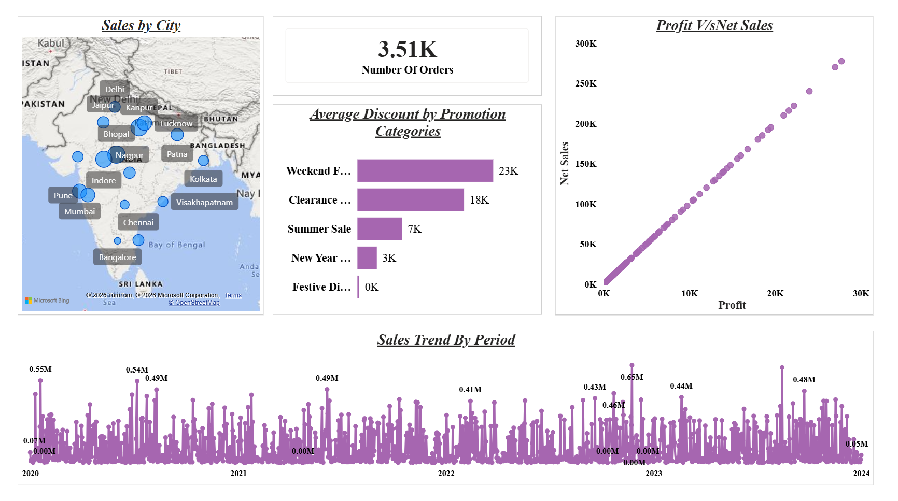
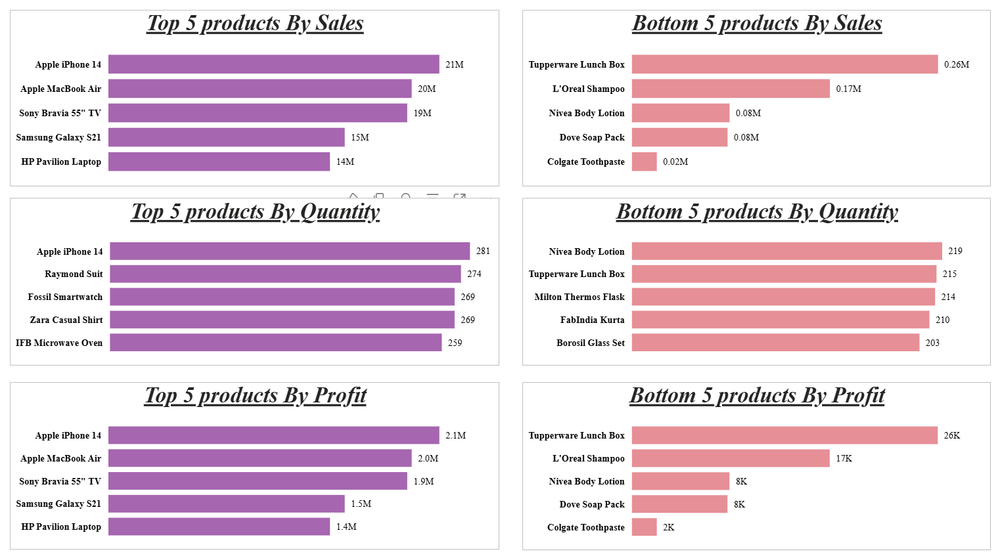
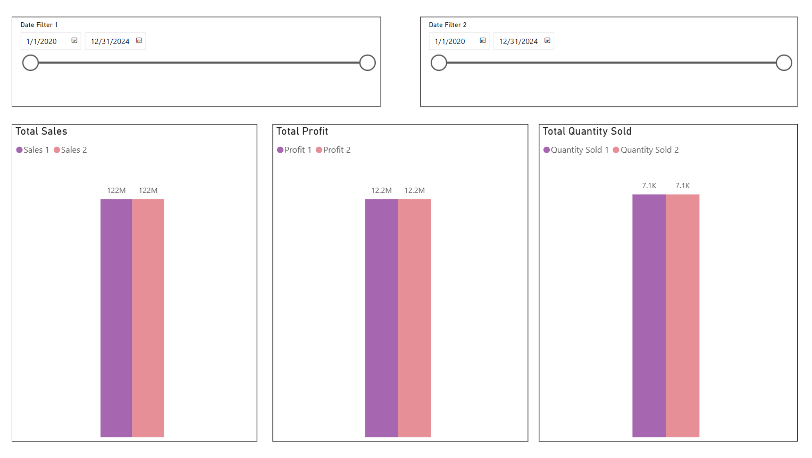
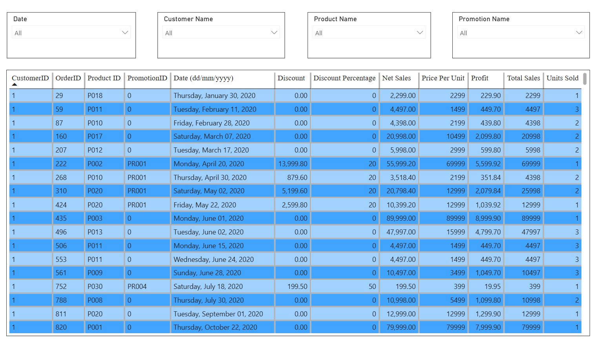

# 📊 ElectroHub Store Sales Data Analysis | Power BI

## Project Overview

This project presents an interactive Sales Data Analysis Dashboard for the ElectroHub Store, developed using Power BI. The dashboard provides insights into sales performance, profitability, discounts, product performance, customer orders, promotions, and city-wise sales through interactive visualizations.

It enables users to monitor key business metrics, analyze sales trends over time, compare performance between different periods, and explore detailed order-level information using dynamic filters and slicers.

## Business Requirements

The dashboard was developed to address the following business requirements:

1. Identify the **Top 5** and **Bottom 5** products based on:
   - Sales
   - Profit
   - Quantity Sold

2. Analyze sales trends over different time periods:
   - Daily
   - Monthly
   - Quarterly
   - Yearly

3. Visualize the relationship between **Sales** and **Profit**.

4. Compare **Sales**, **Profit**, and **Quantity Sold** between any two user-selected periods.

5. Calculate the average discount offered for each discount category.

6. Display the total number of orders.

7. Provide an order-level analysis displaying:
   - Sales
   - Profit
   - Discount
   - Net Sales
   - Other order-related fields

   The report can be filtered by:
   - Product Name
   - Date
   - Customer Name
   - Promotion Name

8. Display sales performance across different cities.

## Dashboard Features

The Power BI dashboard includes the following interactive pages and visualizations:

- **Dashboard Overview**
  - KPI card displaying the Total Number of Orders.
  - Sales by City map visualization.
  - Average Discount by Promotion Categories.
  - Scatter chart showing the relationship between Profit and Net Sales.
  - Sales Trend by Period (Daily, Monthly, Quarterly, and Yearly).

- **Top & Bottom 5 Analysis**
  - Top 5 and Bottom 5 products by Sales, Profit, and Quantity Sold.

- **Sales/Profit/Quantity Comparison (DAX)**
  - Compare Sales, Profit, and Quantity Sold between two user-selected periods using DAX measures.

- **Sales/Profit/Quantity Comparison (Edit Interactions)**
  - Compare Sales, Profit, and Quantity Sold between two user-selected periods using Edit Interactions.
  
- **Order-Level Analysis**
  - Detailed table displaying Sales, Profit, Discount, Net Sales, and other order information.
  - Interactive filters for Product Name, Date, Customer Name, and Promotion Name.
 
## Tools & Technologies Used

- **Power BI Desktop** – Dashboard development and data visualization
- **Power Query** – Data cleaning and transformation
- **DAX (Data Analysis Expressions)** – Calculated measures and KPIs
- **Data Modeling** – Star schema with relationships between dimension and fact tables
- **Microsoft Excel** – Source dataset

## Dashboard Preview

### Dashboard Overview



---

### Top & Bottom 5 Products Analysis



---

### Sales, Profit & Quantity Comparison



---

### Order-Level Analysis



---

### Edit Interactions (Dynamic Comparison)

.png)

## Skills Demonstrated

- Data Cleaning and Transformation using Power Query
- Data Modeling (Star Schema)
- DAX Measures and Calculated Columns
- Time Intelligence
- Interactive Dashboard Design
- KPI Reporting
- Business Intelligence and Data Visualization

## Repository Structure

```text
ElectroHub-sales-data-analysis-powerbi/
│
├── README.md
├── ElectroHub_Sales_Analysis.pbit
├── Requirements.png
├── dataset/
│   └── ElectroHubStore-Sales-Data.xlsx
└── screenshots/
    ├── overview.png
    ├── top-bottom-analysis.png
    ├── comparison-sales-profit-quantitysold.png
    ├── table-visual.png
    └── edit-interactions(req4).png
```

## Author

**Paridhi Singhal**

- GitHub: https://github.com/Idhirap
- LinkedIn: https://www.linkedin.com/in/paridhi-singhal123/
